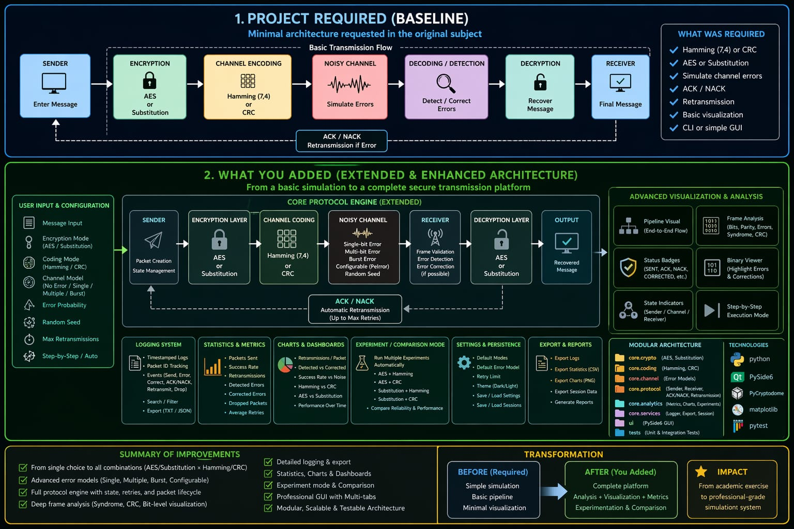
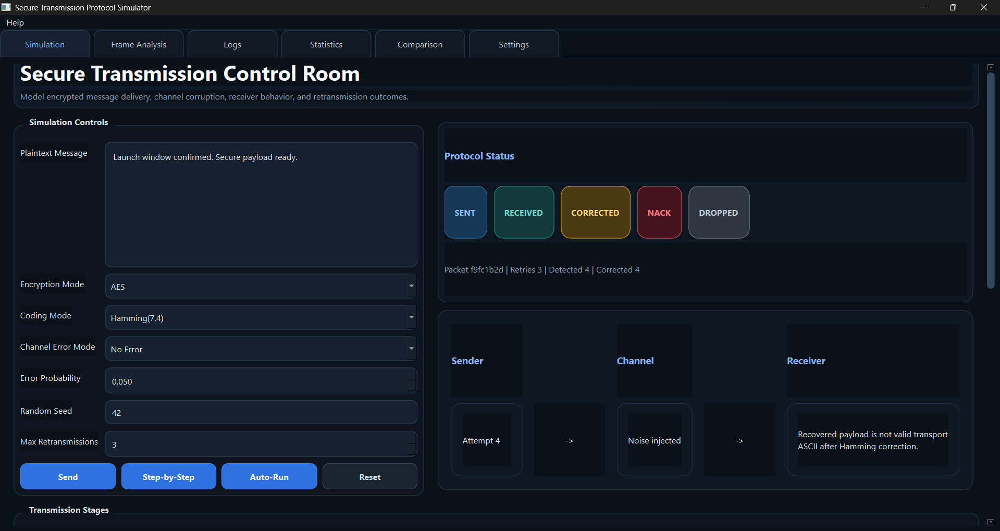
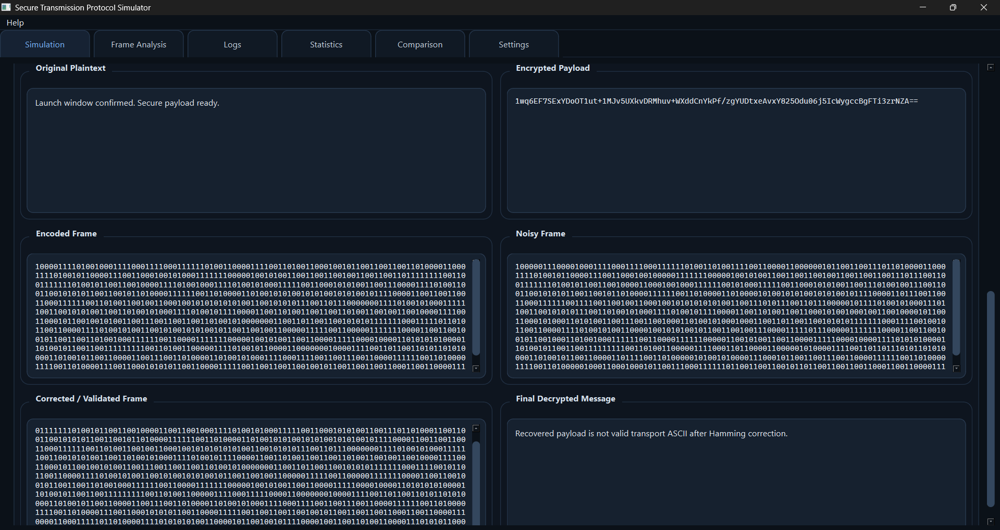
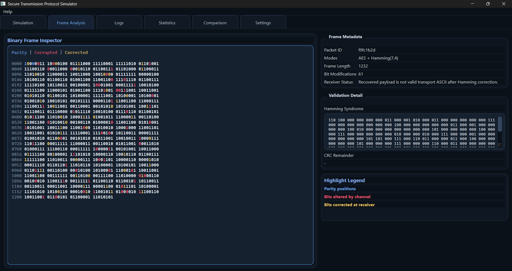
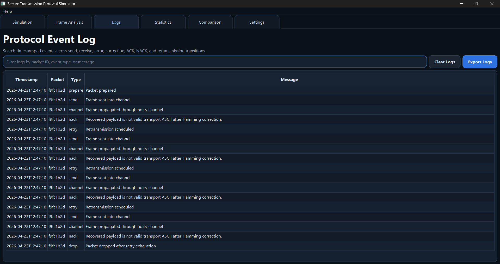
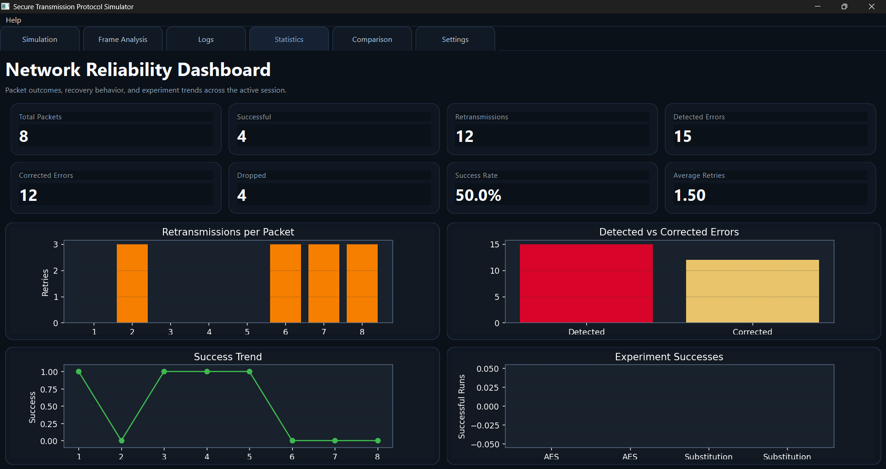
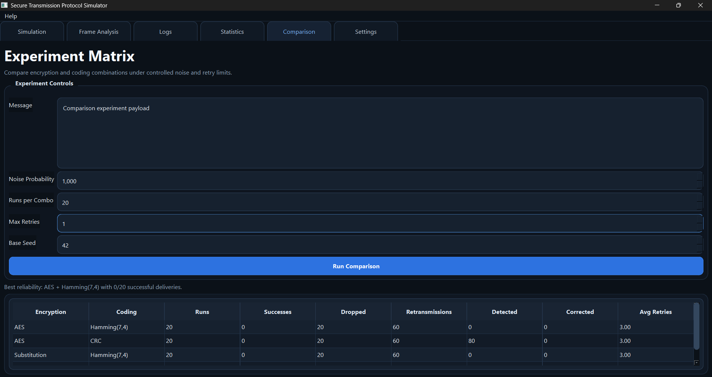
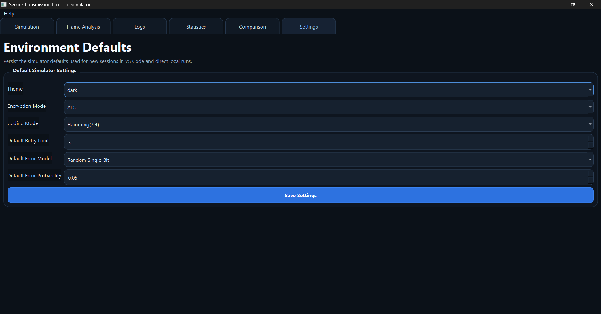

<div align="center">

# Secure Transmission Protocol Simulator


**A full-stack desktop simulation of secure, reliable message delivery** — encryption, error coding, noisy channel injection, ACK/NACK retransmission, and real-time analytics — all in one polished engineering dashboard.

</div>

---

## Overview

This application lets you **visually explore how data travels securely over an unreliable network**. Every layer of the classic transmission stack is simulated and inspectable:



---

## Features

| Category | Details |
|---|---|
| **Encryption** | AES-CBC (128/192/256-bit key) · Substitution cipher |
| **Error Coding** | Hamming(7,4) single-bit correction · CRC-based detection |
| **Channel Model** | Single-bit · Multi-bit · Burst error injection, configurable probability + seed |
| **Protocol** | ACK/NACK receiver logic · Automatic retransmission controller |
| **UI** | 6-tab Qt dashboard — Simulation, Frame Analysis, Statistics, Comparison, Logs, Settings |
| **Analytics** | Live charts (Matplotlib), experiment runner, metrics export |
| **Export** | Logs, session snapshots, and metrics to file |
| **Testing** | Pytest suite covering AES, CRC, Hamming, channel, protocol, and integration |

---

## Screenshots

### Simulation Tab — Control Room
Configure message, encryption, coding scheme, error model and probability, then fire a transmission and watch the ACK/NACK pipeline live.



---

### Frame Analysis — Transmission Stages
Side-by-side view of every transformation: original plaintext → encrypted payload → encoded frame → noisy frame → corrected frame → final decrypted message.



---

### Frame Analysis — Binary Inspector
Bit-level inspection of the frame with parity positions highlighted, channel-modified bits marked in red, and Hamming-corrected bits in green.



---

### Protocol Event Log
Timestamped chronological trace of every protocol event — prepare, send, channel, NACK, retry, drop — with search/filter and one-click export.



---

### Network Reliability Dashboard
Session-wide KPIs (BER, throughput, retransmission rate, success rate) with live Matplotlib charts: retransmissions per packet, detected vs corrected errors, success trend.



---

### Experiment Matrix — Comparison Mode
Automated batch runs across all four combinations (AES/Substitution × Hamming/CRC) under identical noise conditions, producing a side-by-side results matrix.



---

### Settings — Environment Defaults
Persist default theme, encryption mode, coding scheme, retry limit, error model and probability so every session starts from a stable baseline.



---

## Project Structure

```
Secure Transmission Protocol Simulator/
│
├── app/
│   ├── main.py              # Application entry point (PySide6 QApplication)
│   ├── config.py            # App name, org, and persistent settings model
│   └── theme.py             # Global Qt stylesheet builder
│
├── core/
│   ├── crypto/
│   │   ├── aes_cipher.py        # AES-CBC encrypt / decrypt wrapper
│   │   ├── substitution_cipher.py
│   │   └── crypto_utils.py      # Base64 helpers
│   ├── coding/
│   │   ├── hamming74.py         # Hamming(7,4) encode / decode / correct
│   │   ├── crc_codec.py         # CRC encode / verify
│   │   └── bit_utils.py
│   ├── channel/
│   │   ├── noisy_channel.py     # Configurable error injector (single/multi/burst)
│   │   └── error_models.py      # ErrorMode enum
│   ├── protocol/
│   │   ├── sender.py            # Frame builder and transmit logic
│   │   ├── receiver.py          # Frame validator, ACK/NACK decision
│   │   ├── ack_nack.py          # ACK/NACK data model
│   │   ├── retransmission.py    # Retry controller
│   │   └── transmission_controller.py
│   ├── analytics/
│   │   ├── metrics.py           # BER, throughput, retransmission counters
│   │   ├── charts.py            # Matplotlib figure factories
│   │   └── experiment_runner.py # Batch experiment engine
│   └── models/                  # Shared data models
│
├── ui/
│   ├── main_window.py           # Tab host and menu bar
│   ├── simulation_tab.py        # Main send/receive control panel
│   ├── frame_analysis_tab.py    # Bit-level frame inspector
│   ├── statistics_tab.py        # Live analytics charts
│   ├── comparison_tab.py        # A/B experiment view
│   ├── logs_tab.py              # Scrollable transmission log
│   ├── settings_tab.py          # Persistent configuration form
│   ├── widgets/                 # Reusable custom Qt widgets
│   └── dialogs/                 # Modal dialogs
│
├── tests/
│   ├── conftest.py
│   ├── test_aes.py
│   ├── test_channel.py
│   ├── test_crc.py
│   ├── test_hamming.py
│   ├── test_protocol.py
│   └── test_integration.py
│
├── requirements.txt
└── README.md
```

---

## Tech Stack

| Layer | Technology |
|---|---|
| Desktop UI | [PySide6](https://doc.qt.io/qtforpython-6/) (Qt 6 Python bindings) |
| Cryptography | [pycryptodome](https://pycryptodome.readthedocs.io/) — AES-CBC |
| Charts | [Matplotlib](https://matplotlib.org/) embedded in Qt |
| Testing | [pytest](https://pytest.org/) |
| Language | Python 3.11+ |

---

## Quick Start

### 1. Clone

```bash
git clone https://github.com/Fadi-AICH/Secure-Transmission-Protocol-Simulator.git
cd Secure-Transmission-Protocol-Simulator
```

### 2. Create a virtual environment

```bash
# Windows
py -3.11 -m venv .venv
.venv\Scripts\activate

# macOS / Linux
python3.11 -m venv .venv
source .venv/bin/activate
```

### 3. Install dependencies

```bash
pip install -r requirements.txt
```

### 4. Launch the application

```bash
python -m app.main
```

---

## Running Tests

```bash
pytest
```

Or with verbose output:

```bash
pytest -v --tb=short
```

The test suite covers:
- AES encrypt/decrypt round-trip
- Hamming(7,4) encode/decode/single-bit correction
- CRC encode/verify and error detection
- Noisy channel error injection (all modes)
- Protocol sender/receiver ACK/NACK flow
- End-to-end integration transmission

---

## How It Works

### Transmission Flow

1. **User types a message** and picks encryption + coding settings in the Simulation tab.
2. **Sender** encrypts the plaintext (AES-CBC or substitution cipher) then encodes each frame with Hamming(7,4) or appends a CRC checksum.
3. **Noisy channel** flips bits according to the selected error model (single, multi, or burst) at the configured probability. A seed makes runs reproducible.
4. **Receiver** checks each frame: Hamming corrects a single-bit flip silently; CRC detects any corruption and triggers a **NACK**. On ACK the frame is accepted and decrypted.
5. **Retransmission controller** resends NACK'd frames up to the configured retry limit.
6. **Analytics** accumulate BER, throughput, and retransmission rate across the session and render live charts.

### Error Modes

| Mode | Behaviour |
|---|---|
| `NONE` | Perfect channel — no errors injected |
| `SINGLE` | At most one random bit flip per frame |
| `MULTI` | Each bit independently flipped with probability `p` |
| `BURST` | A contiguous run of flips starting at a random offset |

---

## Configuration

All persistent settings (default encryption mode, coding scheme, channel probability, retry limit, theme) are saved between sessions via Qt's `QSettings` and managed through the **Settings tab** in the UI.

---

## License

This project is released for educational and research purposes.

---

<div align="center">
Built with Python · PySide6 · pycryptodome · Matplotlib
</div>
